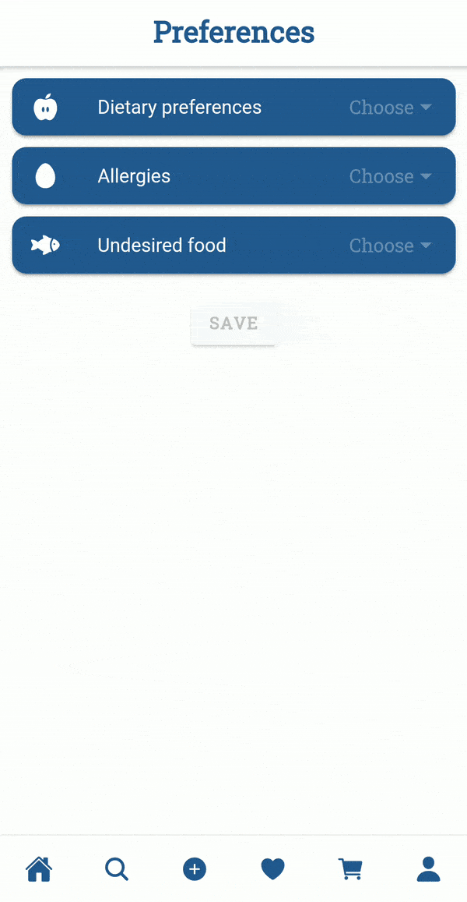
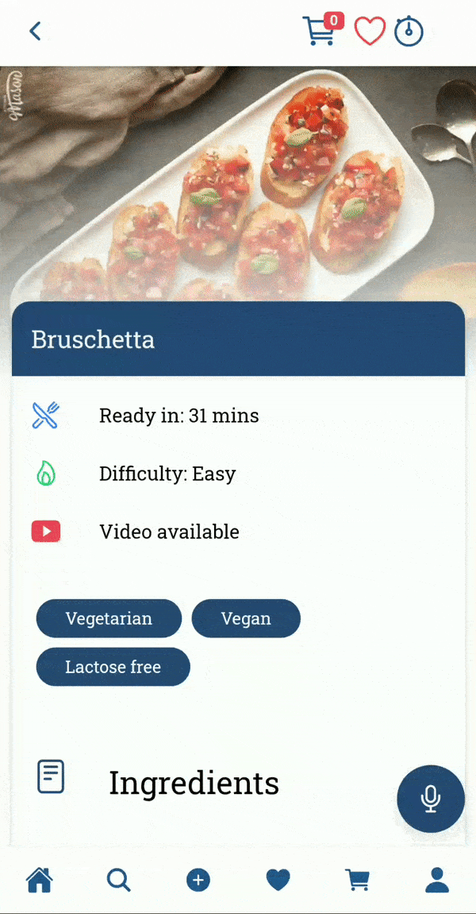
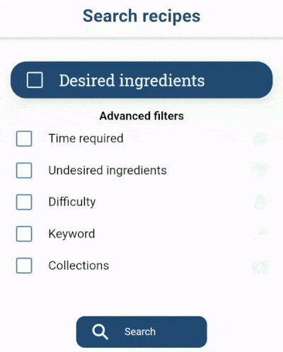
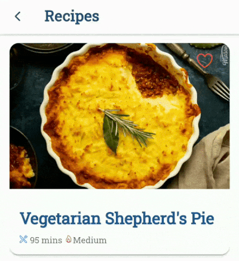

# Overview

- **Academic year:** 2020-2021
- **Project title:** Blue Blueberries - a cookbook application
- **Students:** [Abdullah Chaudhry](https://github.com/chabdullah) and [Claudia Raffaelli](https://github.com/ClaudiaRaffaelli)
- **CFUs:** 9

**Blue Blueberries** is a cooking recipe app built with Ionic framework [1] and Apache Cordova [2], which unlike many others already available application also offers to the user the capability of being able to interact through an in-app voice assistant. The user has available a number of recipes hosted on a Google Firebase database [3] grouped according to predefined collections. However we also wanted to offer the possibility to customize the collections through the creation of private collections stored locally and to which recipes can be added. There is also an advanced search for recipes based on different queries and a shopping list feature. The user can also express their dietary preferences that will be taken into consideration when showing recipes. 

# Tools and Techniques
The main tools employed:
- Ionic Framework [1] toolkit for building a cross-platform mobile app integrated with Angular [4],
- Apache Cordova to build and deploy as a native app [2],
- Google Firebase database for hosting the recipes and fixed collections [3],
- Ionic Storage for saving in-app data like recipes in grocery list, custom collections, dietary preferences [5], 
- Ionic Speech Recognition for the realization of the text to speech for the voice assistant [6].
- TalAter Annyang is a library for speech to text recognition for the voice assistant [8].

# Detailed characteristics
The main features of this application are:
- An **app tour** displayed at the first entering of the user in the application. It was designed with the intent of making the user familiarize with all the available features before interacting with the application itself.
- A **home page** that lists a set of recipe collections divided into different thematic categories. At the top of the page we decided to put a sequence of recipes, which can be scrolled horizontally and that contains picks of the day. This could allow the user to discover new recipes more easily.
- A **preferences page** that stores the user preferences such as dietary preferences, disliked ingredients, allergic ingredients. Recipes with ingredients that fall in this categories will not be shown throughout the app.
- A **grocery list page** to which can be added and removed recipes. It is given the possibility also to temporarily exclude from the list of ingredients all those belonging to a certain recipe. In addition, an ingredient marked as purchased will be displayed as crossed out and placed at the bottom of the list of ingredients. During an initial design of this page we thought of adding up the quantities of a given ingredient in each recipe, thus showing the ingredient in the shopping list only once, with the accumulated quantity. However this choice would have led to ambiguity in case a new recipe was added to the shopping list with an ingredient marked as already purchased. For this reason we decided to modify the appearance of the shopping list by placing under each ingredient a list of the recipes that belong to it with their specific amount. In this way the check is made in regard to the single recipe and not to the ingredient per se.
- The **page of recipe visualization** is designed to provide at a glance all the information necessary for the user to understand whether or not they are interested in the recipe itself. So once opened it is immediately shown an image of the dish, the difficulty and some other characteristics such as if it is suitable for celiac, lactose intolerant and so on. Immediately after, it is shown the list of ingredients and provided a link to a video if available. Then it is listed the whole process of recipe realization divided into steps, each with plenty of photographs.

Home Page                                 | Preferences page                          |  Grocery list page                        |  Page of recipe visualization 
:----------------------------------------:|:-----------------------------------------:|:-----------------------------------------:|:-----------------------------------------:
  |    |   |  

- An **advanced search page** that will allow the user to specify different queries. Some of the filters that we introduce are:
  - Difficulty,
  - Undesirable ingredients and on the other hand, available ingredients,
  - Thematic categories such as Christmas recipes, Easter recipes, Vegetarian recipes and so on and so forth.
- A **custom collections page** that shows all the collections created by the user, along with a private but non-deletable *Favorites* collection. In order to facilitate the quickest possible insertion of a recipe into a private collection, it is possible to click on a heart-shaped icon in the external view page of the recipe. The popover that will be opened allows the insertion of the recipe in previously created collections, as well as the creation of new collections.

 Advanced search page                       |  Managing of custom collections   
|:-----------------------------------------:|:-----------------------------------------:
|   |  

- A **voice assistant** which is made available by pressing a special button located on some pages of the application. The assistant is able to browse recipes according to queries imposed by the user, set a timer, add recipes to the shopping list or private collections, read the steps of a recipe or bring the application view to a certain step. All this is done with the aim of making the application as hand free as possible, which allows the user to keep their *fingers in the pie* for most of the time. For this reason a good addition to this assistant would be the ability to activate it not only by pressing a button, but also vocally.
- At first we decided to add also a **weekly meal plan page** offering different set of recipes each week and for each day of the week, allowing the user to discover new recipes. However with the addition of the picks of the day in the home page, this section was no longer considered necessary.

# Summary
The idea of this application is to allow the easiest possible access to the recipes that are the focus of the user's interest. The functionality of advanced search and specific food preferences wants to favor this requirement as much as possible by not showing uninteresting recipes and speeding up the process of discovering and searching for recipes. In addition, the voice assistant will offer a support role for advanced search, starting timers, reading recipes, inserting recipes into collections. All this with the aim of simplifying to the full the operations that revolve around the main role of the application, which is to allow a convenient consultation of recipes.

# Project Documents
- The [Report](https://github.com/ClaudiaRaffaelli/Blue-Blueberries/blob/9227f6517b091de69c930a890f413eddcc57fd00/Blue%20BlueBerries%20Report.pdf) of the Blue Blueberries application can be found in this repository

# Bibliography
\[1\] https://ionicframework.com

\[2\] https://cordova.apache.org

\[3\] https://firebase.google.com

\[4\] https://angular.io

\[5\] https://github.com/ionic-team/ionic-storage

\[6\] https://ionicframework.com/docs/native/speech-recognition

\[7\] Image in logo from https://www.freepik.com

\[8\] https://github.com/TalAter/annyang

\[9\] Recipes from https://kitchenmason.com

# Acknowledgments
Human Computer Interaction project - Computer Engineering Master Degree @[University of Florence](https://www.unifi.it/changelang-eng.html)
